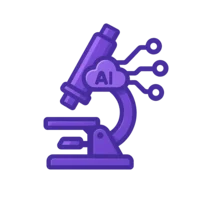

<div align="center">

# AI Tools Lab - Experiment and Test Repository



_Advanced Monitoring and Testing Platform for AI Tools Experimentation_

</div>

## Recent Improvements

### Datadog RUM Integration and Synthetic Tests

- **Datadog RUM** (Real User Monitoring) has been successfully integrated using the CDN approach for better cross-platform compatibility
- **Synthetic Tests** have been updated to use the latest Datadog API format with proper assertion steps
- **Architecture-specific modules handling** has been implemented for better ARM64 compatibility
- **API Test Quota Management** implemented through test consolidation to stay within Datadog's 20-test quota

### Cross-Architecture Compatibility

- Added docker-entrypoint.sh script that detects architecture and ensures proper native modules for both ARM64 and x86
- Fixed environment variables handling in Docker configurations
- Improved native module handling for esbuild and rollup in different environments

> **Note:** Please see TODO.md for a complete list of remaining tasks and project priorities.

## Completed Tasks

- [x] Fix header CSS background color issue in synthetic tests
  - Fixed in Header.astro component by using `var(--secondary-color, #93ACB5)` for proper fallback
  - Enhanced both homepage.js and resources.js synthetic test templates with CSS property validation
  - Fixed CSS validation in the header and resource cards
  
- [x] Fix Docker build issues
  - Switched from Alpine to Ubuntu 24.04 for better native module compatibility
  - Updated Node.js to version 22.x (latest LTS as of May 2025)
  - Upgraded npm to version 11.3.0
  - Updated glob to version 11.0.2 and rimraf to version 6.0.1
  - Moved canvas to optionalDependencies and used --omit=optional for Docker builds
  - Added proper build dependencies for native modules
  - Fixed docker-compose.yml to remove obsolete version attribute
  
- [x] Updated Terraform for synthetic tests
  - Created css_validation_test.tf with proper CSS property validation
  - Fixed JavaScript syntax issues (replaced template literals with standard strings)
  - Fixed Terraform step types (changed from runJavascript to assertFromJavascript)
  - Test successfully validates header background color and text color
  
- [x] Fixed GitHub Actions workflow lint issues
  - Added fallback empty strings for all DD_API_KEY context variables
  - Added eslint disable comment for console statements in test files

## Running Tests with Docker

To run tests using the Docker environment:

```bash
# Make sure old containers are stopped
docker-compose down

# Start the test environment
docker-compose up -d test

# Run the tests
npm run synthetics:sequential
```

---

# AI Tools Lab 🧪

[](https://app.netlify.com/sites/ai-tools-lab-tst/deploys)
[](https://ai-tools-lab-tst.netlify.app/)
[](https://ai-tools-lab.com/)
[](https://app.datadoghq.com/)

<a href="https://ai-tools-lab-tst.netlify.app/" target="_blank">
  
</a>

## About AI Tools Lab

AI Tools Lab provides ~30-40 minute recorded technical demonstrations of hands-on experiences with AI-related tooling for developers. The project aims to help teams navigate the rapidly evolving AI landscape through practical exploration and honest evaluation.

### Why AI Tools Lab Exists

As the definition of software development evolves with AI integration, our approach to developer advocacy must adapt accordingly. AI Tools Lab addresses this need by:

- **Hands-on Exploration**: Testing new AI tools in real development scenarios
- **Honest Evaluation**: Providing unfiltered feedback on tool effectiveness
- **Knowledge Sharing**: Creating accessible learning resources for the entire team
- **Collaborative Growth**: Building expertise together through shared experiments

### Mission & Goals

1. Educate and form evidence-based opinions on emerging AI technologies to better understand modern development challenges

2. Establish credibility as leaders in AI-enhanced engineering excellence and thought leadership

3. Share practical knowledge about new development approaches across all technical teams

4. Foster collaboration and collective learning among teammates

## Quick Start

This project contains the website for AI Tools Lab, a collection of experiments and resources related to AI tools.

### Prerequisites

- Node.js 22.x (latest LTS as of May 2025)
- npm 11.3.0 or higher
- Docker and Docker Compose (for running tests)
- Datadog account (for monitoring)

### Package Version Requirements

This project requires the following specific package versions to ensure compatibility:

- glob: ^9.3.5 (ensuring compatibility with Node.js modules)
- rimraf: ^6.0.1

The Docker images have been updated to use Ubuntu 24.04 for better compatibility with native Node.js modules, particularly for ARM architectures.

### Installation

```bash
# Clone the repository
git clone https://github.com/jasonhand/ai-tools-experiments.git
cd ai-tools-experiments

# Install dependencies
npm install

# Set up environment variables
cp .env.example .env
# Edit .env with your configuration values
```

### Development

```bash
# Start the development server
npm run dev

# The site will be available at http://localhost:4321
```

### Testing

```bash
# Run sequential tests (recommended for local development)
npm run synthetics:sequential

# Run multithreaded tests (faster, used in CI/CD)
npm run synthetics:parallel

# Run component-specific tests
npm run test:components
```

### Deployment

The project is automatically deployed to Netlify when changes are pushed to the main branch.

```bash
# Manual deployment
npm run build
# Deploy using Netlify CLI (if installed)
npm run deploy
```

### Datadog Integration

Monitoring is provided through Datadog. Set your API key in the `.env` file:

```
DD_API_KEY=your_api_key_here
```

Activate various Datadog features:

```bash
# Run with Datadog Application Security
DD_APPSEC_ENABLED=true npm run dev

# Run with Datadog Profiler
DD_PROFILING_ENABLED=true npm run dev

# Run with minimal security monitoring (no APM)
DD_APM_TRACING_ENABLED=false DD_APPSEC_ENABLED=true npm run dev
```

## Directory Structure

- `src/`: Source files for the Astro project
  - `pages/`: Astro pages (routes)
    - `[slug].astro`: Dynamic route for episode pages
    - `index.astro`: Main page listing episodes
    - `resources.astro`: Resources page
    - `observations.astro`: Observations page
  - `content/`: Content files
    - `transcripts/`: HTML transcript files for episodes
  - `components/`: Reusable Astro components
  - `layouts/`: Page layouts
- `public/`: Static assets served at the root
  - `images/`: Image files used throughout the site
  - `styles.css`: Main stylesheet for the site
- `proxy/`: Netlify functions
  - `datadog-proxy.js`: Datadog monitoring proxy
- `script.js`: JavaScript functionality for Datadog monitoring
- `tests/`: Automated tests
  - `docker-build-test.js`: Puppeteer tests for Docker builds
  - `run-tests.sh`: Test runner script
- `terraform/`: Infrastructure as code for Datadog monitoring
  - `datadog_synthetics.tf`: Synthetic test definitions
  - `api_tests.tf`: API tests for episode pages
